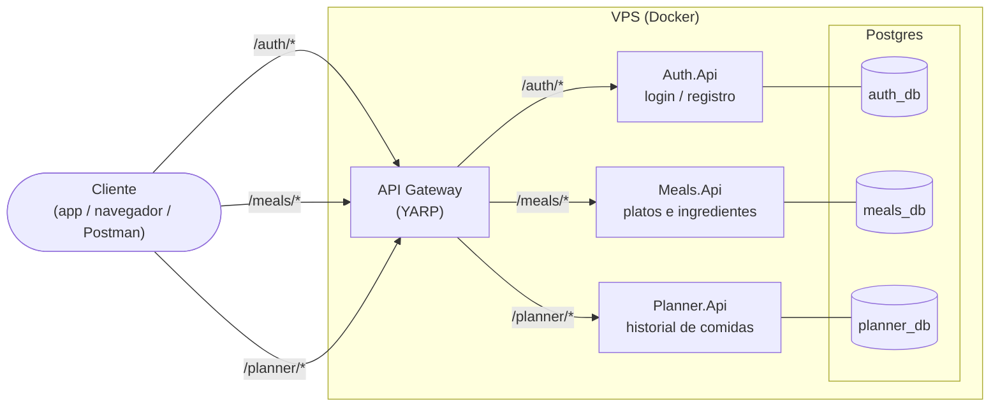
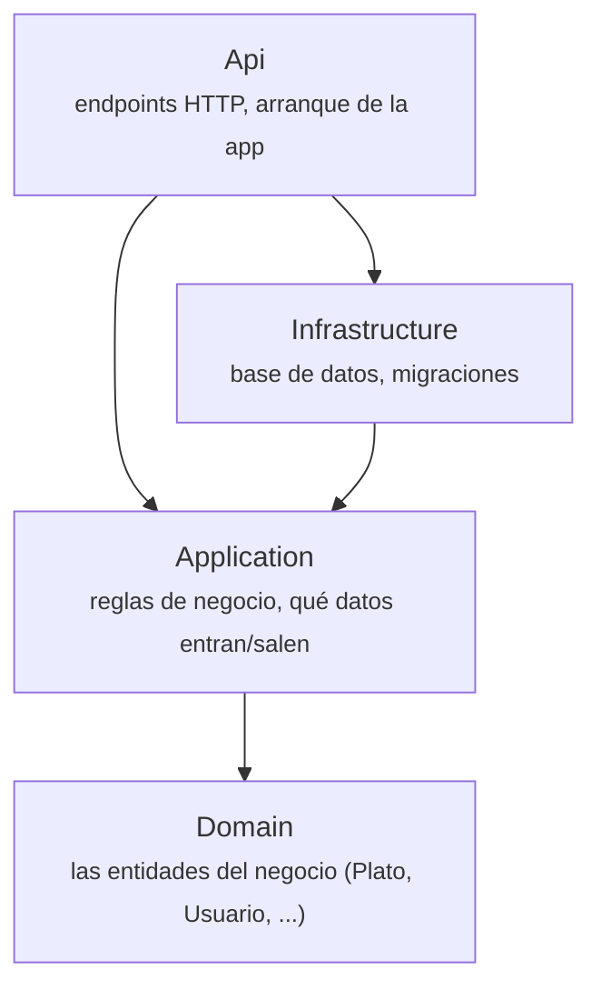
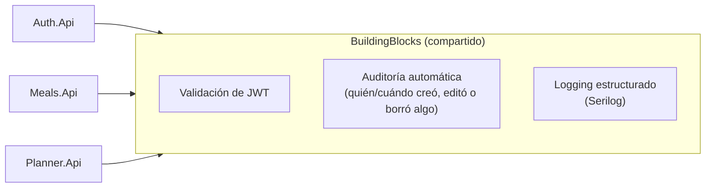
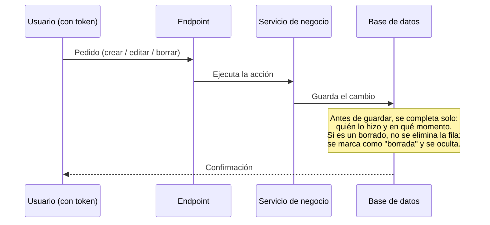
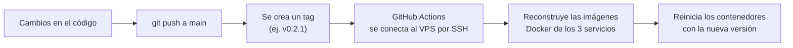

# Arquitectura del sistema

## 1. Vista general — cómo viaja una petición

Todo el tráfico entra por un único punto (el Gateway), que decide a qué servicio reenviar cada pedido según la ruta. Cada servicio tiene su propia base de datos — ninguno accede directamente a la base de otro.

**Cómo leerlo:** el cliente nunca le habla directo a `Meals.Api` o `Planner.Api` — todo pasa por el Gateway, que es el único servicio expuesto a internet. `Auth.Api` es quien entrega el token de sesión (JWT); `Meals.Api` y `Planner.Api` lo validan cada uno por su cuenta, sin volver a consultarle a `Auth.Api` en cada pedido.

## 2. Capas dentro de cada servicio

`Meals`, `Planner` y `Auth` están armados igual internamente — 4 capas, cada una en su propio proyecto, que solo pueden depender de la capa de abajo (nunca al revés):

**Por qué importa:** `Domain` no sabe que existe una base de datos ni HTTP — es el corazón del negocio, aislado. Si mañana se cambia de motor de base de datos, solo se toca `Infrastructure`; el resto ni se entera.

## 3. Lo que comparten los 3 servicios

Hay una pieza más, `BuildingBlocks`, que **no es un servicio** — es una caja de herramientas común para no repetir código de "plomería" (autenticación, auditoría, logs) en cada servicio:

Gracias a esto, agregar autenticación, auditoría o logs a un servicio **nuevo** el día de mañana es solo enchufarlo a `BuildingBlocks` — no hay que volver a programar nada de eso.

## 4. Qué pasa cuando se crea, edita o borra algo

Este es el mecanismo que registra automáticamente quién hizo qué y cuándo, sin que nadie tenga que escribirlo a mano en cada lugar:

## 5. Cómo se llega a producción

Subir código a `main` **no despliega nada** — el despliegue solo ocurre cuando se crea un tag a propósito. Esto separa "guardar avances" de "publicar una versión nueva".
